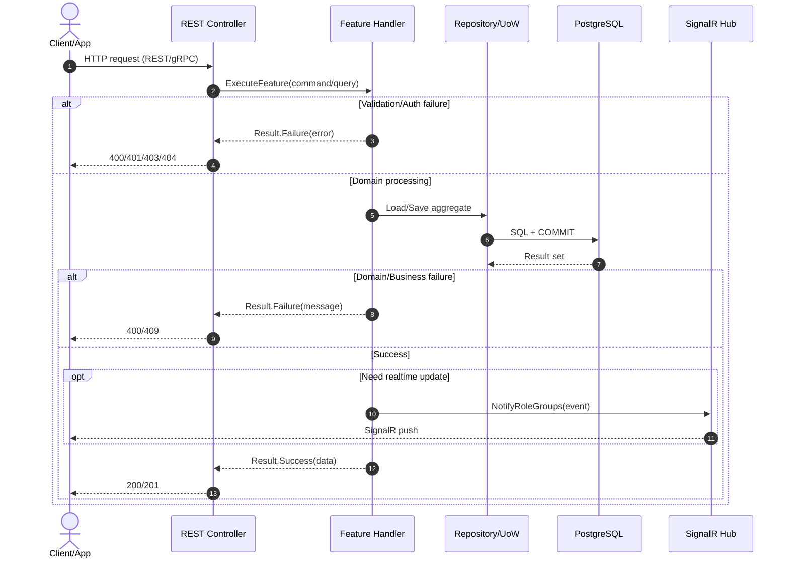
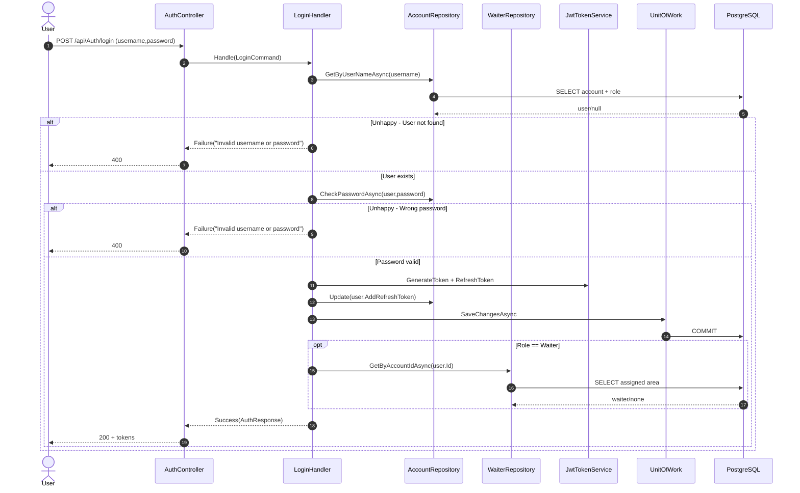
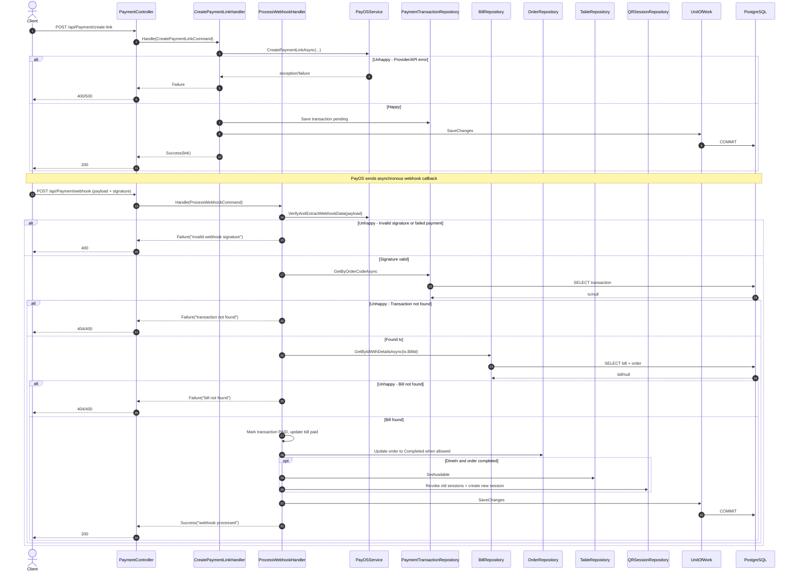
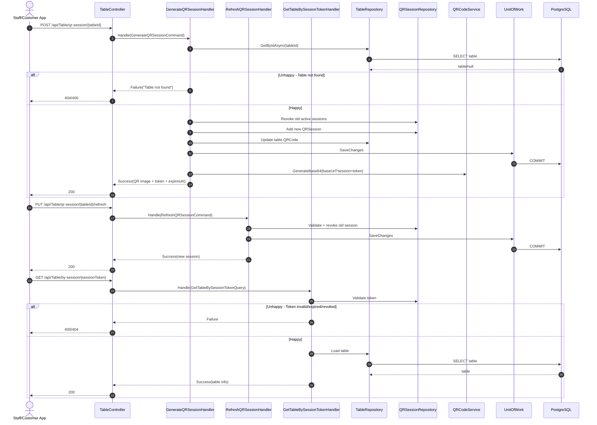

# RestaurantOrderTracking - Sequence Diagrams (Mermaid)

Tai lieu nay tong hop theo phong cach senior: co inventory chuc nang, luong happy case va unhappy case.

## 1) Functional Inventory (API surface)

- Auth
  - POST /api/Auth/login
  - POST /api/Auth/CreateAccount
  - POST /api/Auth/CreateWaiter
  - POST /api/Auth/CreateChef
  - POST /api/Auth/RegisterCustomer
- Account
  - GET /api/Account
- Area
  - GET /api/Area
  - POST /api/Area
  - PUT /api/Area
  - DELETE /api/Area/{id}
- Category
  - GET /api/Category
  - POST /api/Category
  - PUT /api/Category
  - DELETE /api/Category/{id}
- Product
  - GET /api/Product
  - POST /api/Product
  - PUT /api/Product/Update-Info
  - PUT /api/Product/Update-Status/{id}
- Table + QR Session
  - GET /api/Table
  - GET /api/Table/{id}
  - GET /api/Table/area/{areaId}
  - POST /api/Table
  - PUT /api/Table/update-info
  - PUT /api/Table/update-status
  - POST /api/Table/qr-session/{tableId}
  - PUT /api/Table/qr-session/{tableId}/refresh
  - GET /api/Table/by-session/{sessionToken}
- Order
  - GET /api/Order
  - GET /api/Order/{id}
  - POST /api/Order
  - PUT /api/Order/Update-Info
  - PUT /api/Order/Update-Status
  - POST /api/Order/online
- OrderItem
  - GET /api/OrderItem
  - POST /api/OrderItem
  - PUT /api/OrderItem/{orderItemId}/Update-Status
  - PUT /api/OrderItem/{orderItemId}/Update-Info
- Bill (Cashier)
  - GET /api/Cashier/bill
  - GET /api/Cashier/bill/{id}
  - POST /api/Cashier/bill
  - PUT /api/Cashier/bill/update
  - PUT /api/Cashier/bill/pay
  - PUT /api/Cashier/bill/cancel
- Payment (PayOS)
  - POST /api/Payment/create-link
  - GET /api/Payment/info/{orderCode}
  - POST /api/Payment/cancel
  - POST /api/Payment/webhook
  - POST /api/Payment/confirm-webhook
- Customer
  - GET /api/Customer/account/{accountId}
  - PUT /api/Customer/{id}
  - DELETE /api/Customer/{id}
- WorkSchedule
  - GET /api/WorkSchedule
  - POST /api/WorkSchedule
  - PUT /api/WorkSchedule
  - DELETE /api/WorkSchedule/{id}
  - PUT /api/WorkSchedule/CheckIn/{id}
  - PUT /api/WorkSchedule/CheckOut/{id}
- Dashboard
  - GET /api/Dashboard/summary

## 2) Global API Processing Template (ap dung cho tat ca endpoint)



## 3) Auth Login Flow (happy + unhappy)



## 4) Order + OrderItem + Role-based WebSocket

```mermaid
sequenceDiagram
    autonumber
    actor Staff as Waiter/Chef/Cashier/Manager
    participant OC as OrderController
    participant OIC as OrderItemController
    participant OH as UpdateStatusOrderHandler
    participant OIH as UpdateStatusOrderItemHandler
    participant OR as OrderRepository
    participant OIR as OrderItemRepository
    participant LogR as OrderItemLogRepository
    participant TR as TableRepository
    participant UoW as UnitOfWork
    participant NS as NotificationService
    participant Hub as RestaurantHub
    participant DB as PostgreSQL

    Note over Staff,Hub: Client joins role groups via /hubs/restaurant for realtime updates

    par Update Order Status
        Staff->>OC: PUT /api/Order/Update-Status
        OC->>OH: Handle(UpdateStatusOrderCommand)
        OH->>OR: GetByIdAsync(orderId)
        OR->>DB: SELECT Order
        DB-->>OR: Order/null

        alt Unhappy - Order not found
            OH-->>OC: Failure("Order not found")
            OC-->>Staff: 400/404
        else Order found
            OH->>OH: order.UpdateStatus(newStatus)
            alt Unhappy - Invalid transition
                OH-->>OC: Failure(ex.Message)
                OC-->>Staff: 400
            else Valid
                opt Completed/Cancelled + has table
                    OH->>TR: GetByIdAsync(tableId)
                    TR->>DB: SELECT Table
                    DB-->>TR: Table
                    OH->>TR: SetAvailable + Update
                end
                OH->>UoW: SaveChangesAsync
                UoW->>DB: COMMIT
                OH->>NS: NotifyOrderStatusChanged(...)
                NS->>Hub: Push to role groups
                Hub-->>Staff: SignalR NotifyOrderStatusChanged
                OH-->>OC: Success
                OC-->>Staff: 200
            end
        end
    and Update OrderItem Status
        Staff->>OIC: PUT /api/OrderItem/{id}/Update-Status
        OIC->>OIH: Handle(UpdateStatusOrderItemCommand)
        OIH->>OIR: GetByIdAsync(orderItemId)
        OIR->>DB: SELECT OrderItem
        DB-->>OIR: OrderItem/null

        alt Unhappy - OrderItem not found
            OIH-->>OIC: Failure("OrderItem ... not found")
            OIC-->>Staff: 400/404
        else Found
            OIH->>OIH: UpdateStatus (domain sequential rule)
            alt Unhappy - Invalid transition
                OIH-->>OIC: Failure(ex.Message)
                OIC-->>Staff: 400
            else Valid
                opt Confirmed->Cooking without assignee
                    OIH-->>OIC: Failure("AssigneeId is required")
                    OIC-->>Staff: 400
                else Assignee OK
                    OIH->>LogR: AddAsync(OrderItemLog)
                    OIH->>UoW: SaveChangesAsync
                    UoW->>DB: COMMIT
                    OIH->>NS: NotifyOrderStatusChanged(orderId,...)
                    NS->>Hub: Push to role groups
                    Hub-->>Staff: SignalR NotifyOrderStatusChanged
                    OIH-->>OIC: Success
                    OIC-->>Staff: 200
                end
            end
        end
    end
```

## 5) Payment Flow (PayOS + Webhook + Bill/Order/Table)



## 6) Table QR Session Lifecycle (Generate/Refresh/Resolve)


```

## 7) Notes for engineering governance

- Role-based WebSocket:
  - Hub add connection vao group role:{role} khi connect.
  - Notification service cho phep targetRoles linh hoat theo feature.
- Unhappy case conventions:
  - Input/domain rule failure -> Result.Failure -> 400 class response.
  - Not found -> Result.Failure (co the map 404 o controller neu can).
  - External provider fail -> log + failure response, khong commit partial state.
- Transaction boundary:
  - Handler commit qua UoW sau khi aggregate state hop le.
  - Webhook/payment flow la idempotency-sensitive, can bo sung idempotent keys neu scale cao.
